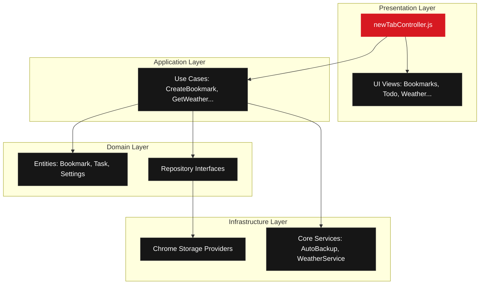

# ─── ░ N O T H I N G T A B ░ ───

> An open-source Chrome new tab extension built with a minimalist, Nothing-inspired interface.

<p align="left">
  
  
  
</p>

---

## ◌ Key Features

*   **Monochromatic Dot-Matrix Aesthetic:** Designed to match the premium, OLED-friendly, low-light Nothing OS theme.
*   **Dynamic Combined Clock & Pomodoro:** Tap the hero clock to initiate customizable Pomodoro focus sessions.
*   **Modular Left/Right Sidebars:** Toggle widgets inline to suit your workspace layout (Weather, Tasks, Calendar).
*   **Drag-&-Drop Workspace Manager:** Drag shortcuts to reorder them or drop them directly onto categories to group them.
*   **Clean Architecture (DDD):** Decoupled infrastructure, domain models, and presentation layers for robust extensibility.

---

## ◌ System Architecture



---

## ◌ Quick Installation

### Prerequisites
*   Google Chrome (v88+) or any Chromium-based browser (Edge, Brave, Arc, Opera)
*   Node.js (v16+) _(optional, only for development tooling)_

### Step-by-Step Setup

1.  **Clone the Repository**
    ```bash
    git clone https://github.com/your-username/NothingTab.git
    ```
2.  **Open Extensions Panel**
    Navigate to `chrome://extensions/` in your Chrome address bar.
3.  **Enable Developer Mode**
    Toggle the **Developer mode** switch in the top-right corner of the window.
4.  **Load the Extension**
    Click the **Load unpacked** button in the top-left, and select the project's root folder (`NothingTab`).
5.  **Launch**
    Open a new browser tab to experience the NothingTab environment.

---

## ◌ Customization & Usage

*   **Customize:** Click the dot-matrix gear icon (bottom-right) to toggle the customization sidebar. Adjust CSS variables, accent colors, custom CSS overrides, and choose which widgets are active.
*   **Widget Panel:** Click the layout icon (bottom-right) to toggle the right-hand panel for Calendar and Task lists.
*   **Shortcut Organiser:** Drag-and-drop links inside categories to re-order them, or drag a link onto a category tab to migrate it. Right-click any shortcut to modify its name, target URL, or delete it entirely.

> [!NOTE]
> To enable automatic daily data backups, click the "Resume Auto Backup" notification if prompted.

---

## ◌ Contributing

We welcome developer contributions to refine NothingTab.
1.  Fork the project repository.
2.  Create your feature branch: `git checkout -b feature/CoolFeature`
3.  Commit your updates: `git commit -m 'Add CoolFeature'`
4.  Push changes: `git push origin feature/CoolFeature`
5.  Open a Pull Request.

---

## ◌ License

Distributed under the MIT License. See `LICENSE` for details.
